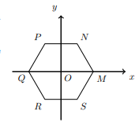

##  [MNPQRS] é um hexágono regular que pode ser dividido em triângulos equiláteros
## M(1,0) e N pertence ao 1º Quadrante
## Qual é a equação reduzida da reta MN?
A) $\large{y=-\sqrt{3}x+\sqrt{3}}$

B) $\large{y=-\sqrt{3}x+\sqrt{6}}$

C) $\large{y=-x+2}$

D) $\large{y=-x+1}$

