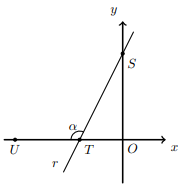

## Considera a reta r, r: y=2x+4, e os pontos S T U
## S e T são os pontos de intersecção da reta nos eixos coordenados e U pertence a Ox
## Qual é o valor aproximado às centésimas, em radianos de $\hat{STU}$

A) $\large{4.25}$

B) $\large{2.68}$

C) $\large{2.03}$

D) $\large{1.82}$