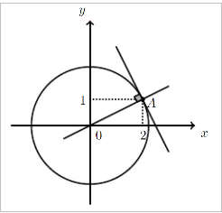

## Atendendo aos dados da figura, qual dos seguintes pontos pertence à reta que perpendicular à reta OA?
### 

A) $\large{(\dfrac{2}{5},8)}$

B) $\large{(4,10)}$

C) $\large{(\dfrac{2}{5},4)}$

D) $\large{(4,13)}$

