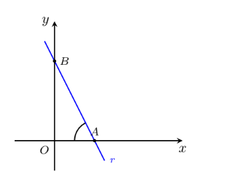

## Na figura estão representados os pontos A e B e a reta r de equação y=-2x+6
## A e B são os pontos de intersecção da reta r nos eixos coordenados
## Qual é o valor em radiano, aproximado às centésimas de BAO?

A) $\large{1.12}$

B) $\large{1.11}$

C) $\large{2.03}$

D) $\large{2.04}$