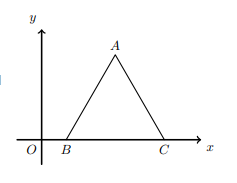

## O triângulo [ABC] é equilátero, ponto A tem ordenada positiva, os pontos B e C pertencem ao eixo Ox, o ponto B tem abcissa 1 e o ponto C tem abcissa maior do que 1
## Qual é a equação reduzida da reta AB ?

A) $\large{y=\sqrt{2}x-\sqrt{2}}$

B) $\large{y=\sqrt{2}x+\sqrt{2}}$

C) $\large{y=\sqrt{3}x+\sqrt{3}}$

D) $\large{y=\sqrt{3}x-\sqrt{3}}$