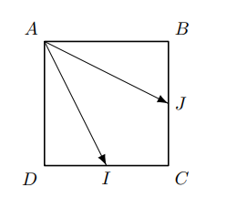

## Considera o quadrado [ABCD], I é o ponto médio de [DC] e J é o ponto médio de [BC]
## Qual é o valor do produto escalar de $\vec{AI} \cdot \vec{AB}$?
# 

A) $\large{||\vec{AJ}||^2}$

B) $\large{||\vec{AJ}||}$

C) $\large{||\vec{AB}||^2}$

D) $\large{||\vec{AD}||}$

