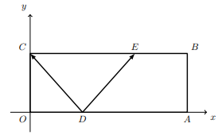

## Considera uma o retângulo [OABC] onde, $A \in Ox$, $C \in Oy$, $D \in [OA]$ e $E \in [CB]$
## $\bar{EB}=\bar{OD}=\dfrac{OA}{3}$, $\bar{OC} = \dfrac{\bar{OA}}{4}$ e $\vec{DC} \cdot \vec{DE} = -7$
## Qual é o valor da norma de $\bar{OA}$ ?
### 
A) $\large{10}$

B) $\large{14}$

C) $\large{6}$

D) $\large{12}$

