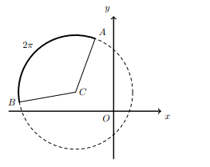

## Considera uma circunferência de equação $(x+2)^2+(y-1)^2=9$, onde o ponto C é o centro da circunferência, A e B são dois pontos da circunferência e o arco AB têm de comprimento $2\pi$
## Qual é o valor do produto escalar $\vec{CA} \cdot \vec{CB}$
## 

A) $\large{\dfrac{-1}{2}}$

B) $\large{-9}$

C) $\large{\dfrac{-10}{3}}$

D) $\large{\dfrac{-9}{2}}$

