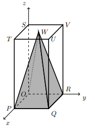

## Considera a Pirâmide Quadrangular Regular onde, a sua base está contida no plano xOy, $P \in Ox$, $R \in Oy$, $S \in Oz$, $U(2,2,4)$.

## Qual a amplitude de $\hat{WQV}$? 

A) $\large{17º}$

B) $\large{18º}$

C) $\large{19º}$

D) $\large{20º}$

