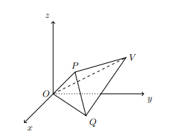

## Considera a Pirâmide Triângular Não Regular [OPQV] onde, O é a origem do referêncial, $V(0,4,2)$, $P(2,2,2)$, $Q(3,3,0)$, $OPQ: x-y=0$, $PQV: x+y+z=6$ e $OPV: x+y-2z=0$

## Qual a amplitude de $\hat{OPQ}$? 

A) $\large{90º}$

B) $\large{100º}$

C) $\large{80º}$

D) $\large{95º}$

