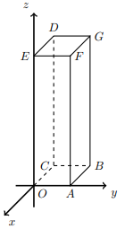

## Considera o Prisma Quadrangular Regular [OABCDEFG] onde, $C \in Ox$, $A \in Oy$, $E \in Oz$, $A(0,2,0)$, $OFB: 3x+3y-z=0$, $P \in [BG]$ e $z_P = 1$ e R é o simétrico de P em relação à origem.

## Qual a amplitude de $\hat{RAP}$? 

A) $\large{108º}$

B) $\large{109º}$

C) $\large{110º}$

D) $\large{111º}$

