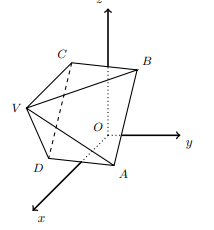

## Considera a pirâmide quadrangular regular [ABCDV] em que $A(2,1,0)$, $C(0,-1,2)$, $V(3,-1,2)$,
## Qual é a amplitude do angulo $\hat{VAC}$
## 

A) $\large{65}$

B) $\large{55º}$

C) $\large{60º}$

D) $\large{50º}$

