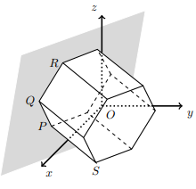

## Considera o Prisma Hexagonal Regular em que, [PQ] e [QR] são arestas de uma das bases do prisma e $\bar{PQ}=4$
## Qual é o produto escalar de $\vec{QP} \cdot \vec{QR}$  

A) $\large{-4}$

B) $\large{-7}$

C) $\large{-8}$

D) $\large{-9}$

