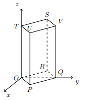

## Considera o Prisma Quadrangular Regular [OPQRSTUV] em que, a face [OPQR] está contida no plano xOy, $Q \in Oy$ e $T \in Oz$ e o plano $STU$ é dado por $z=3$

## Qual é o produto escalar de $\vec{UP} \cdot \vec{RS}$  

A) $\large{-4}$

B) $\large{-7}$

C) $\large{-8}$

D) $\large{-9}$

