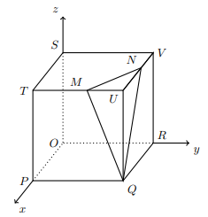

## Considera o cubo [OPQRSTUV] de aresta 5 onde, O é a origem do referencial, $P \in Ox$, $R \in Oy$,  $S \in Oz$ e o triângulo escaleno [MNQ] é a secção produzida no cubo pelo plano $\alpha$ de equação $10x+15y+6z=125$
## Qual a amplitude de $\hat{MQN}$ 

A) $\large{37}$

B) $\large{38º}$

C) $\large{39º}$

D) $\large{40º}$

