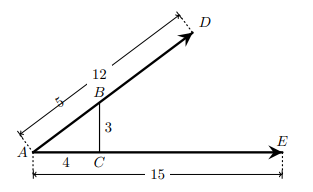

## Na figura ao lado estão representados dois vetores, $\vec{AD}$ e $\vec{AE}$, de normas 12 e 15, respetivamente. No segmento de reta [AD] está assinalado um ponto B e no segmento de reta [AE] está assinalado um ponto C, o triângulo retângulo [ABC] e os seus lados têm 3 , 4 e 5 unidades de comprimento.

## Qual o produto escalar de $\vec{AD} \cdot \vec{AE}$ 

A) $\large{141}$

B) $\large{142}$

C) $\large{143}$

D) $\large{144}$

