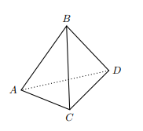

## Considera o Tetraedro Regular onde, A B C e D  são os vértices e $\bar{AB}=6$

## Qual é o valor do produto escalar $\vec{BC} \cdot \vec{BD}$? 

A) $\large{18}$

B) $\large{18\sqrt{2}}$

C) $\large{36}$

D) $\large{36\sqrt{2}}$

