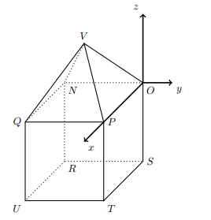

## Considera o poliedro [VNOPQURST], que se pode decompor num cubo e numa pirâmide quadrangular regular, $P \in Ox$, $U(4,-4,-4)$, considera um ponto A com a mesma abcissa e ordenada que U e que $\vec{OT} \cdot \vec{OA}=8$

## Qual a cota do ponto A? 

A) $\large{2}$

B) $\large{3}$

C) $\large{\dfrac{2}{3}}$

D) $\large{1}$

