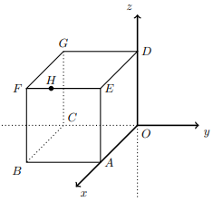

## Considera o cubo [OABCDEFG] de aresta 3 onde, $A \in Ox$, $C \in Oy$, $D \in Oz$ e $H(3,-2,3)$

## Qual é o valor exato de $\sin^2{(\hat{AHC})}$ 
A) $\large{\dfrac{198}{247}}$

B) $\large{\dfrac{199}{247}}$

C) $\large{\dfrac{200}{247}}$

D) $\large{\dfrac{197}{247}}$

