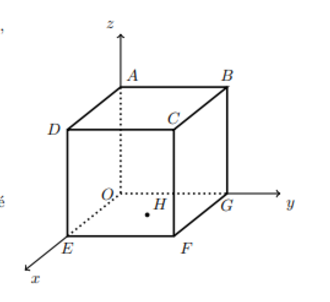

## Considera um cubo onde, O é a origem do referencial, $A \in 0x$, $G \in 0y$,  $E \in 0y$,  H é o centro da face [OGFE] e $x+y=10$ contém os pontos D, B e H
## Qual é a medida da aresta do cubo?
## 
A) $\large{10}$

B) $\large{5}$

C) $\large{10\sqrt{2}}$

D) $\large{5\sqrt{2}}$
