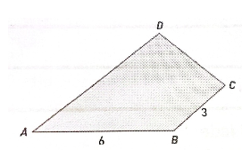

## Na figura está representado um quadrilátero [ABCD). Sabe-se que: $\bar{AB}=6$,$\bar{BC}=3$, $\vec{AB} \cdot \vec{BC} = 16$
## A que valor corresponde $\vec{AC} \cdot \vec{AC}$?
## 
A) $\large{77}$

B) $\large{32}$

C) $\large{196}$

D) $\large{59}$
