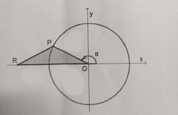

## A Circunferencia tem centro em O e raio de 5 u.c
## O ponto P desloca-se ao longo do 2º Quadrante da circunferencia e o ponto R desloca-se ao longo de 0x tal que [OPR] é sempre isósceles
## Qual das expressões dá a área do triângulo em função de $\alpha$?

A) $\large{-\sin{\alpha}\cos{\alpha}}$

B) $\large{25\sin{\alpha}\cos{\alpha}}$

C) $\large{-25\sin{\alpha}\cos{\alpha}}$ 

D) $\large{2\sin{\alpha}\cos{\alpha}}$