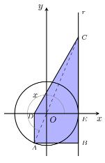

## Considera a circunferência trigonométrica e que, $r: x=1$, $A \in$ Circunferência e $A(-\dfrac{5}{13};-\dfrac{12}{13})$, B é a projeção ortogonal de A sobre a reta r e D sobre o eixo Ox, $C(1;\dfrac{12}{5})$ e $\hat{EOA}=x$
## Qual é a área do trapézio? 

A) $\large{\dfrac{2481}{845}}$

B) $\large{\dfrac{2482}{845}}$

C) $\large{\dfrac{2483}{845}}$

D) $\large{\dfrac{2484}{845}}$

