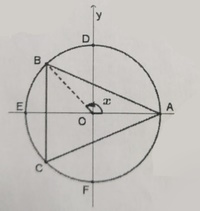

## [BAC] é um triangulo isósceles inscrito em uma circunferencia de raio 2
## As coordenadas de A são (2,0), o ponto B desloca-se ao longo de DE e o ponto C é o seu simétrico em relação a 0y
## Cada posição do ponto B, x designa a amplitude em radianos de AOB
## Qual é a formula do perímetro do triângulo [ABC]? $\space$ 

A) $\large{P(x) = 4\sin{x}+2\sqrt{8-8\cos{x}}}$

B) $\large{P(x) = 2\sin{x}+\sqrt{4-4\cos{x}}}$

C) $\large{P(x) = 4\sin{x}+2\sqrt{8-8\cos^2{x}}}$

D) $\large{P(x) = 2\sin{x}+\sqrt{4-4\cos^2{x}}}$
