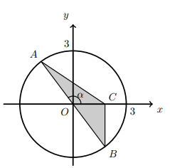

## O segmento de reta [AB] é um diâmetro da circunferência, de raio 3
## $\alpha$ é a inclinação da reta AB,$\alpha \in ]\frac{\pi}{2},2[$, ponto C pertence ao semieixo positivo Ox.
## A reta BC é paralela ao eixo Oy
## Qual é a área do triângulo em função de $\alpha$

A) $-9\sin^2{\alpha}\cos{\alpha}$

B) $-\sin{\alpha}\cos{\alpha}$

C) $-9\sin{\alpha}\cos{\alpha}$

D) $-9\sin{\alpha}\cos^2{\alpha}$