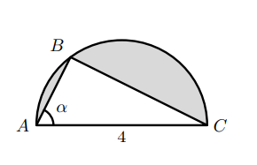

## Considera o triângulo retângulo [ABC] inscrito em uma circunferência de diâmetro 4.
## Seja $\alpha$ a amplitude de $\hat{CAB}$
## Qual das opções corresponde à área sombreada em função de $\alpha$? 

A) $2\pi -8\sin{\alpha}\cos{\alpha}$

B) $\pi -4\sin{\alpha}\cos{\alpha}$

C) $\pi -8\sin{\alpha}\cos{\alpha}$

D) $2\pi -4\sin{\alpha}\cos{\alpha}$