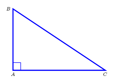

## Considera o triÂngulo [ABC], retÂngulo em A, onde $\hat{ABC}=\alpha$, $\hat{BCA}=\beta$, $\bar{AB}=x$, $\bar{AC}=y$ e $\bar{BC}=z$
## Qual é o valor  de $\dfrac{\sin{(\dfrac{\pi}{2}-\alpha})+\cos{(\pi+\beta)}}{\tan{(\pi-\beta)} \times \cos {\beta}}$ ?
# 

A) $\large{\dfrac{y-x}{x}}$

B) $\large{\dfrac{x-y}{x}}$

C) $\large{\dfrac{y-x}{y}}$

D) $\large{\dfrac{x-y}{y}}$

