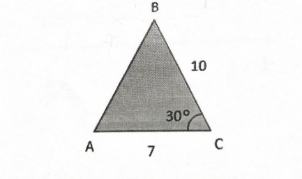

## Considera o triângulo [ABC] da figura. Sabe-se que: $\hat{ACB}=30°,  \bar{BC} =10 \space e \space \bar{AC} =7$
## Qual o valor de , com aproximação às décimas?
## 
A) $\large{71,6º}$

B) $\large{108,4º}$

C) $\large{72,0º}$

D) $\large{70,4º}$