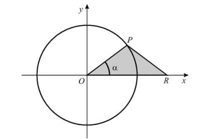

## P pertence à circunferência e ao primeiro quadrante, R desloca-se no eixo Ox tal que [OPR] é sempre isósceles
## Sendo $\alpha=\hat{ROP}$, qual é a expressão da área do triângulo [OPR] em função de $\alpha$?
## 
A) $\large{\sin{\alpha}\cos{\alpha}}$

B) $\large{2\sin{\alpha}\cos{\alpha}}$

C) $\large{\dfrac{1+\sin{\alpha}\cos{\alpha}}{2}}$

D) $\large{\dfrac{(1+\cos{\alpha})\sin{\alpha}}{2}}$