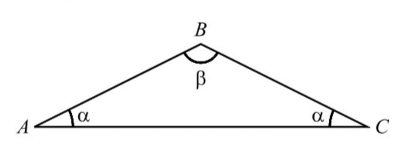

## Considera o triângulo [ABC] com dois ângulos de amplitude $\alpha$ e $\beta$
## Qual das igualdades abaixo é verdadeira?
## 
A) $\large{\cos{\beta}=\sin{2\alpha}}$

B) $\large{\cos{\beta}=\cos{2\alpha}}$

C) $\large{\cos{\beta}=-\sin{2\alpha}}$

D) $\large{\cos{\beta}=-\cos{2\alpha}}$