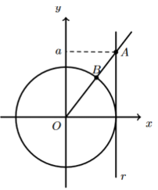

## Considera o circulo trigonométrico,  a reta r, $r:x=1$ e o ponto A que pertence à reta r, de ordenada a (a>1) e a semireta $\dot{OA}$ que intersecta a circunferência em B
## Qual expressão nos dá a abcissa do ponto B? 
## 
A) $\large{\dfrac{1}{\sqrt{a^2+1}}}$

B) $\large{\sqrt{a^2+1}}$

C) $\large{\dfrac{1}{\sqrt{a^2-1}}}$

D) $\large{\sqrt{a^2-1}}$