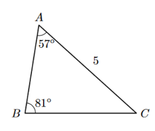

## Considera o triângulo [ABC] onde, $\bar{AC}=5$; $\hat{BAC}=57º$; $\hat{ABC}=81º$
## Qual é o valor de $\bar{AB}$ arredondado às centésimas
## 
A) $\large{3,39}$

B) $\large{3,35}$

C) $\large{3,31}$

D) $\large{3,43}$