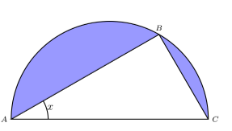

## Considera um triângulo retângulo [ABC] inscrito na semicircunferência de raio 6 e sabe-se que o ponto B move-se no arco AC, nunca coincidindo com A nem com C;
## Qual é o valor  da área sombreada em função de x, $x \in ]0;\dfrac{\pi}{2}[$ ?

A) $\large{18\pi-36\cos{x}\sin{x}}$

B) $\large{9\pi-36\cos{x}\sin{x}}$

C) $\large{9\pi-72\cos{x}\sin{x}}$

D) $\large{18\pi-72\cos{x}\sin{x}}$
