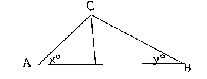

## Na imagem abaixo, que não está à escala,$\sin(x)=\cos(y)$ . Se $x=3p-22$  e $y=5p-12$ , qual é o valor de $p$ ?
## 
A) $\large{\dfrac{37}{2}}$

B) $\large{\dfrac{31}{2}}$

C) $\large{\dfrac{27}{2}}$

D) $\large{\dfrac{23}{2}}$