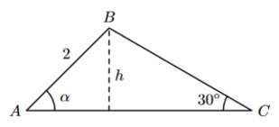

## Considera o triângulo [ABC] onde $\bar{AB}=2$ e $\hat{ACB}=30º$, onde $\alpha=\hat{BAC}$
## Qual das opções representa $\bar{BC}$
## 
A) $\large{4\sin{\alpha}}$

B) $\large{6\sin{\alpha}}$

C) $\large{4\cos{\alpha}}$

D) $\large{6\cos{\alpha}}$