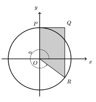

## Considera o circulo trigonométrico e o trapézio [OPQR] onde, $P(0,1)$, $x_Q = x_R$, $y_Q = y_P$,  R pertence ao 4ºQuadrante e à circunferência, seja $\alpha$ o ângulo cujo lado origem é Ox e o lado extremidade a semireta $\dot{OR}$
## Qual das opções dá a área de [OPQR] em função de $\alpha$?
## 

A) $\large{\cos{(\alpha)}-\dfrac{\sin{\alpha}\cos{\alpha}}{2}}$

B) $\large{\dfrac{\cos{(\alpha)}}{2}-\sin{(\alpha)}\cos{(\alpha)}}$

C) $\large{\cos{(\alpha)}+\dfrac{\sin{\alpha}\cos{\alpha}}{2}}$

D) $\large{\dfrac{\cos{(\alpha)}}{2}+\sin{(\alpha)}\cos{(\alpha)}}$