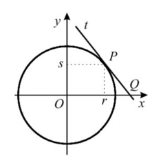

## Considera o ponto $P(r,s)$, que pertence à circunferência e ao 1º quadrante do circulo trigonométrico, a reta t, tangente à circunferência no ponto P e o ponto Q, a intersecção da reta t com Ox
## Qual é a abcissa do ponto Q? 
## 
A) $\large{\dfrac{1}{2r}}$

B) $\large{\dfrac{1}{r}}$

C) $\large{\dfrac{2}{2r}}$

D) $\large{\dfrac{1}{r^2}}$