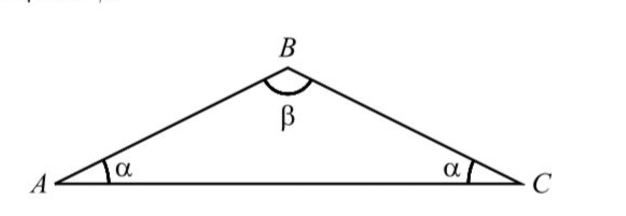

## Qual das igualdades é verdadeira?
## 
A) $\large{\cos{\beta}=\sin{2\alpha}}$

B) $\large{\cos{\beta}=\cos{2\alpha}}$

C) $\large{\cos{\beta}=-\sin{2\alpha}}$

D) $\large{\cos{\beta}=-\cos{2\alpha}}$